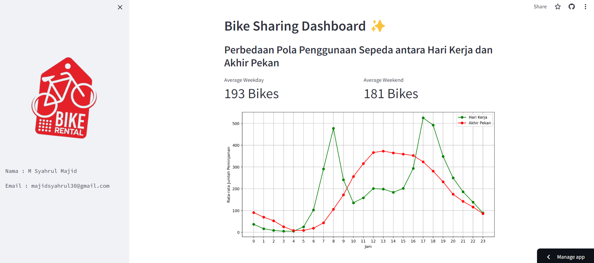

# Bike Sharing Dashboard ✨
## Setup environment
```
conda create --name main-ds python=3.11
conda activate main-ds
pip install numpy pandas scipy matplotlib seaborn jupyter streamlit babel
```
## Run steamlit app
```
streamlit run bike_sharing.py
```
## Link bike sharing dashboard
https://bikesharingdaytapy.streamlit.app/
## Screenshot my dashboard

